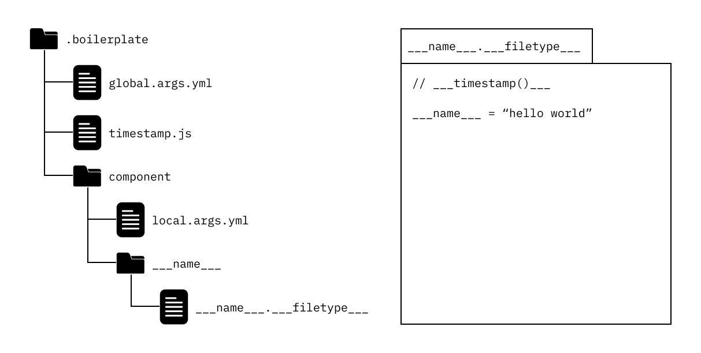

## Boil Directory

Boilerplate templates are stored in a directory called `.boilerplate` at the root of your project. It consists of sub-directories, a `global.args.yml` file and optionally some `*.js` files.

Here is a simple example of a `.boilerplate` template directory.
<br />



<br />

**Each sub-directory is a boilerplate template**. You will be able to generate boilerplate files and/or folders from a template using the following command (**[see here for more details](commands.md)**).

```sh
boil up [DIRECTORY] [ARGS], e.g. boil up component --name Example --filetype js
```

## Template Arguments

**Template arguments are variables** that can be used within your boilerplate templates. They can be defined globally, i.e. shared amongst all templates, within the `global.args.yml` file. For template-specific arguments you can define them in `local.args.yml` files within your individual template folders.

:::info

Local arguments takes precedence over global arguments. If the same argument name is defined in both `global.args.yml`, as well as `local.args.yml`, then the definition from `local.args.yml` will be used.

:::

Here is the structure of an argument definition within the `*.args.yml` files.

```yml
# definition of 'filetype' arg
filetype: # REQUIRED: arg will be called using --filetype
  shorthand: ft # OPTIONAL: arg can be called using -ft instead of --filetype
  description: file type # OPTIONAL: used in help menu
  default: js # OPTIONAL: if arg not provided by user then default to this value
  options: # OPTIONAL: if user provides an input not in this list then throw an error
    - js
    - py
    - go
```

## Placeholders

**Template arguments can be called within file names, folder names and within any file's content** using template argument placeholders.

The placeholders are defined by wrapping them in triangles. The placeholders will be replaced with the user-provided argument values when the boilerplate files and/or folders are generated.

```
<| argument |>
```

## Template Functions

Template arguments are able to solve the majority of templating configuration problems. However, by adding the power of Javascript functions, there is really no limit to how dynamic and customized your templates can be.

In order to use template functions **the filenames need to match the desired argument name**. Below is the structure of a template function.

```js
// usage in templates: <| example(arg1, arg2, ...) |>
module.exports = function (/* any args incl. local & global template args */) {
  // insert code here
};
```

:::info

You can use any arguments you like - just the way you'd write a regular Javascript function. **If you'd like to use template arguments as inputs to your function then match the function argument name to the desired template argument name**.

:::

Here's a simple example.

```js
// greeting.js
module.exports = function (name) {
  return `Hi, my name is ${name}!`;
};
```

You could then invoke the function above within a template placeholder.

```text
<| greeting(name) |>
```
